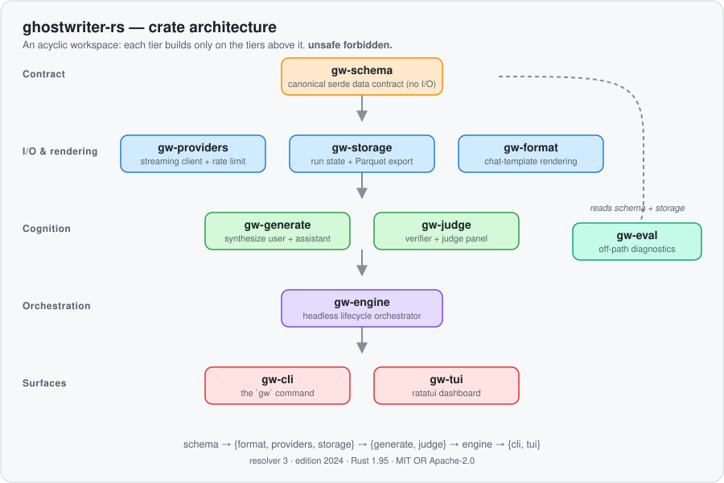
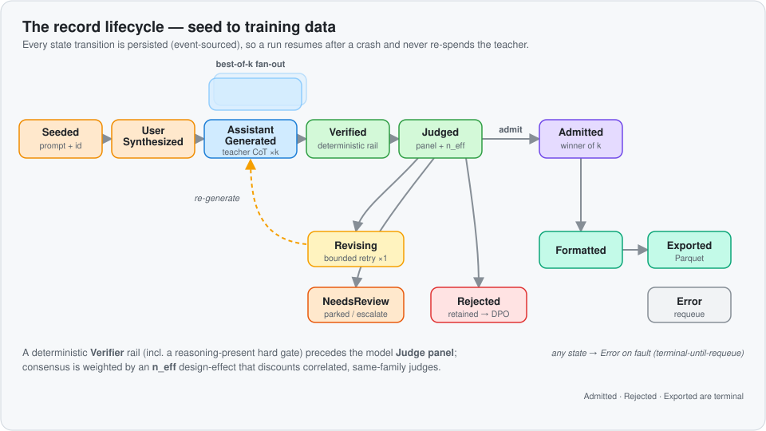

# ghostwriter-rs

**A Rust harness for generating graded chain-of-thought reasoning traces as model fine-tuning data.**


ghostwriter-rs drives a **teacher** model to produce full chain-of-thought reasoning, runs each
trace through a deterministic **verifier** and a model **judge panel**, admits only the traces that
earn it, and exports the winners as a model-agnostic supervised-fine-tuning (SFT) dataset. The whole
run is event-sourced: it spends a budget you set, resumes after a crash without re-spending the
teacher, and records the full provenance of every decision.

It is built for one job — **minting high-quality reasoning data you can trust** — and it treats every
expensive call (teacher, judge) as something to be budgeted, graded, and accounted for.

> **Status:** active development toward `0.1.0`. The generation → grading → export pipeline runs
> end-to-end today; the surfaces and config are stabilizing. APIs may still shift before the first
> tagged release.

---

## Why

Distilling a strong reasoner into a smaller student is only as good as the data. Naively sampling a
teacher gives you fluent-but-wrong traces, silent truncations, and a corpus that quietly collapses
onto a few modes. ghostwriter-rs makes the quality bar **explicit and enforced**:

- a **verifier rail** rejects malformed or truncated traces before a judge ever sees them;
- a **judge panel** scores each trace against a rubric, and consensus is discounted when judges are
  correlated (so nine lookalike judges don't masquerade as nine independent votes);
- **best-of-k** generates several candidates per prompt and admits only the best;
- a hard **budget** governs spend, with a defined policy for what happens when it's reached.

The output is a columnar dataset plus a sidecar manifest, ready to render into the chat template of
your target student model.

---

## Architecture

Ten crates in a strictly **acyclic** workspace — each tier depends only on the tiers above it.

<p align="center"></p>

| Crate | Role |
|---|---|
| `gw-schema` | Canonical serde data contract (no I/O). Everything depends on it. |
| `gw-providers` | Streaming OpenAI-compatible client with chain-of-thought capture, GCRA rate limiting, and retries. |
| `gw-storage` | Run / queue / provenance state (SQLite) and columnar Parquet export. |
| `gw-format` | Chat-template rendering and the SFT / preference export projection. |
| `gw-generate` | Synthesizes the user turn and the teacher's assistant turn. |
| `gw-judge` | The deterministic verifier and the model judge-panel grading + admission. |
| `gw-engine` | The headless orchestrator: the lifecycle state machine and sharded executor. |
| `gw-cli` | The `gw` command-line entrypoint. |
| `gw-tui` | A live [ratatui](https://ratatui.rs) dashboard over the engine event stream. |
| `gw-eval` | Off-path, model-free dataset diagnostics and promotion gating. |

The dependency spine: `schema → {format, providers, storage} → {generate, judge} → engine → {cli, tui}`,
with `gw-eval` consuming only `schema` + `storage`.

---

## How it works

Each prompt becomes a **record** that walks a 12-state lifecycle. Every transition is persisted, so a
run is fully resumable and every admission decision is auditable after the fact.

<p align="center"></p>

1. **Seeded** — a prompt is read from the seed source and a record id is minted.
2. **UserSynthesized** — the user turn is prepared and passes its gate.
3. **AssistantGenerated** — the teacher is called for **k** candidates, capturing content *and*
   reasoning.
4. **Verified** — a deterministic rail checks each candidate, including a *reasoning-present* hard
   gate when the area requires chain-of-thought.
5. **Judged** — the judge panel scores the surviving candidates; consensus is weighted by an
   **n_eff** design-effect that discounts correlated judges.
6. The verdict routes the record:
   - **Admitted** — the best of k (terminal-good for grading);
   - **Rejected** — retained for preference (DPO) pairs and judge auditing;
   - **Revising** — a single bounded re-generation, then re-judged;
   - **NeedsReview** — parked for human/verifier adjudication.
7. **Formatted → Exported** — admitted records are projected to the target template per the CoT
   policy and written into a versioned Parquet shard.

`Error` is terminal-until-requeue: a faulted record carries its last error and attempt count, and a
re-run picks it back up.

---

## Install

Requires a **Rust 1.95+** toolchain (edition 2024).

```sh
git clone https://github.com/jscott3201/ghostwriter-rs
cd ghostwriter-rs
cargo build --release
```

The binary is `gw` (`target/release/gw`). Run `cargo run -- <args>` during development, or install it:

```sh
cargo install --path crates/gw-cli
```

---

## Quickstart

**1. Provide your provider key via the environment.** It is read only from `OPENROUTER_API_KEY` and is
never a config field or a CLI flag, so it can't leak into shell history, a process listing, or a
`--help` dump.

```sh
export OPENROUTER_API_KEY=sk-or-...
```

**2. Write a prompts file** — one user turn per line (lines beginning with `#` are skipped):

```text
# prompts.txt
A train leaves Boston at 60 mph and another leaves NYC at 40 mph...
Prove that the square root of 2 is irrational.
Design a rate limiter for an API gateway and justify the algorithm.
```

**3. Write a config** (`gw.toml`) — see the [reference](#configuration) below:

```toml
db         = "gw-run.sqlite"
budget_usd = 5.0

[area]
training_area = "reasoning"
teacher_slug  = "z-ai/glm-5.2"
cot_required  = true
k             = 3
rubric        = "Grade the reasoning for correctness, rigor, and explicit assumptions."

[area.thresholds]
accept_threshold = 0.80
reject_below     = 0.60
min_n_eff        = 1.5

[[area.judges]]
slug   = "deepseek/deepseek-v4-pro"
family = "deepseek"

[export]
out    = "out/dataset.parquet"
format = "chat-ml"
cot    = "supervised"
```

**4. Run it** — generate, grade, admit, and persist; the report prints when it finishes:

```sh
gw gen run --config gw.toml --run-id demo-001 --prompts prompts.txt \
  --shards 8 --max-in-flight 8 --budget-usd 5.0
```

Prefer a live dashboard? Swap `run` for `tui`. Crashed or interrupted? Re-run the **same** `--run-id`
with the **same** `--prompts` and `--shards` to resume — already-committed work is skipped and the
teacher is never re-spent.

**5. Export** the admitted records to Parquet (a pure, provider-free step you can re-run any time):

```sh
gw gen export --db gw-run.sqlite --out out/dataset.parquet --run-id demo-001 \
  --format chat-ml --cot supervised
```

You get `out/dataset.parquet` plus an `out/dataset.parquet.manifest.json` sidecar recording the
target template, CoT policy, dataset version, and record counts.

---

## Configuration

Configuration is layered, lowest precedence first: **built-in defaults → TOML file (`--config`) →
`GW_`-prefixed environment variables → CLI flags**. A missing file still yields a runnable shape.

```toml
# ─── run-wide ───────────────────────────────────────────────────────────────
db          = "gw-run.sqlite"   # SQLite store: run state, queue, provenance
budget_usd  = 5.0               # hard spend cap — the primary guard (default 5.0)
on_breach   = "drain"           # at the cap: "drain" (let in-flight finish) | "abort"
provider_base_url = "https://openrouter.ai/api/v1"   # OpenAI-compatible endpoint
provider_rpm      = 60          # per-lane requests/min for the rate limiter

# ─── the training area: what to generate and how to grade it ────────────────
[area]
training_area = "reasoning"     # stamped into provenance + the record-id prefix
teacher_slug  = "z-ai/glm-5.2"  # any OpenRouter chat model that emits reasoning
cot_required  = true            # require chain-of-thought (a hard Verify gate)
k             = 3               # best-of-k fan-out (default 1; clamped to >= 1)
correlation_rho = 0.7           # cold-start inter-judge correlation prior

# Optional teacher caps — keep a long reasoner from running away mid-trace:
teacher_max_tokens           = 20000   # combined completion cap (visible + reasoning)
teacher_reasoning_max_tokens = 12000   # reasoning-token sub-cap

# Optional area-wide judge headroom for dense traces (per-judge overrides below):
judge_max_tokens           = 8000
judge_reasoning_max_tokens = 6000      # mutually exclusive with judge_reasoning_effort

rubric = """
Grade the reasoning trace for correctness, rigor, and clarity.
Reward sound derivations and explicit assumptions; penalize unjustified leaps.
"""

# ─── admission thresholds + the correlation-guard floors ────────────────────
[area.thresholds]
accept_threshold = 0.80   # aggregate >= this (with trusted consensus) -> Admit
reject_below     = 0.60   # aggregate <  this -> Reject
min_n_eff_ratio  = 0.50   # floor on effective/nominal judge count
min_n_eff        = 1.5    # absolute effective-judge floor, else -> NeedsReview

# ─── the judge panel (one or more; same-family judges are de-weighted) ──────
[[area.judges]]
slug   = "deepseek/deepseek-v4-pro"
family = "deepseek"        # coarse family tag for same-family exclusion
# optional per-judge overrides: rubric_id, max_tokens, reasoning_max_tokens, reasoning_effort

# ─── optional end-of-run export ─────────────────────────────────────────────
[export]
out             = "out/dataset.parquet"
format          = "chat-ml"      # see Export targets below
cot             = "supervised"   # supervised | masked | stripped
dataset_version = "0.1.0"
```

Notes:

- **The API key is never in this file.** Only `OPENROUTER_API_KEY` (from the environment) authenticates.
- `judge_reasoning_max_tokens` and `judge_reasoning_effort` are **mutually exclusive** in the same
  table — set one or the other, not both. The same holds for per-judge `reasoning_max_tokens` /
  `reasoning_effort`.
- Any field can be overridden by an env var (`GW_BUDGET_USD=10.0`) or, for the common knobs, a CLI
  flag (`--budget-usd`, `--k`, `--shards`, `--on-breach`).

---

## CLI reference

```
gw gen run      Headless run: generate → grade → admit → persist; prints the report.
gw gen tui      The same run with the live ratatui dashboard.
gw gen export   Export admitted records from a store to a Parquet shard (no providers).
gw gen replay   Resume a started run from its persisted checkpoints.
gw eval audit-separation   Selector-vs-random separation diagnostic over a store (JSON).
gw eval promote            Variance-aware promotion gate over two eval_results.json (JSON).
```

**`gw gen run` / `gw gen tui`**

| Flag | Meaning |
|---|---|
| `--config <FILE>` | TOML config (the figment base layer). |
| `--run-id <ID>` | Idempotency key. Re-running the same id over the same seeds **resumes**. |
| `--prompts <FILE>` | Newline-delimited prompts file (one user turn per line). |
| `--db <PATH>` | Override the SQLite store path. |
| `--shards <N>` | Partition the seed space into N shards (default `1`) — the primary concurrency axis. |
| `--max-in-flight <N>` | Cap on seed items in flight across all shards (default `4`). |
| `--k <K>` | Override the best-of-k fan-out. |
| `--budget-usd <USD>` | Override the run-wide budget cap. |
| `--on-breach <MODE>` | `drain` or `abort` at the cap. |

**`gw gen export`** — `--db`, `--out`, `--run-id` (optional), `--format`, `--cot`.

**`gw gen replay`** — resumes `--run-id` from a store; you must pass the **same** `--config`,
`--prompts`, and `--shards` the original run used (the seed→shard partition is `index % shards`, so a
different value would re-partition the space and duplicate or orphan records).

> **Concurrency, briefly.** The shard is the real unit of parallelism (one task per shard), and within
> a prompt the **k** best-of-k candidates fan out concurrently. `--shards` × `k` is your throughput
> dial; `--max-in-flight` bounds total concurrent items so you stay within provider limits.

---

## Export targets & CoT policy

`--format` records the target chat template in the export manifest. The Parquet shard itself is a
**columnar dump of the canonical conversation, not a pre-rendered template** — the target bytes are
produced downstream from the manifest plus the conversation column:

| `--format` | Target |
|---|---|
| `gemma4` | Gemma-4. Token bytes are transcribed from the research spec and golden-file tested; they are **pending a byte-for-byte diff-verify against the official pinned `chat_template.jinja`** before production SFT (nothing fetches the template at runtime). The system turn is folded into the following `user` turn and the upstream `<\|think\|>` marker is not emitted. |
| `chat-ml` | ChatML. |
| `sharegpt` | ShareGPT. |
| `openai-messages` | OpenAI `messages` conversational. |
| `harmony` | gpt-oss Harmony channels. |
| `trl-prompt-completion` | TRL prompt/completion. |

**Tool trajectories.** `openai-messages` and `trl-prompt-completion` carry `tool_calls` and each
tool result's `tool_call_id` verbatim. The other four targets (`gemma4`, `chat-ml`, `sharegpt`,
`harmony`) have nowhere to put them, so rendering a tool conversation for one **fails closed** with
a structured error naming the route, the dropped signal and the first offending message — it never
emits a training target in which a tool turn has been flattened into prose. The supported way to get
a tool-faithful target is to export the canonical `messages_json` conversation and apply the model's
official chat template in a consumer that owns that template. Text-only conversations are unaffected
on every target.

`--cot` controls how the captured reasoning is projected:

- **`supervised`** — reasoning is rendered into the loss region (train on the chain-of-thought).
- **`masked`** — reasoning is rendered but masked out of the loss.
- **`stripped`** — reasoning is dropped (answer-only).

The export is a columnar Parquet dump plus a manifest. One `messages_json` column holds the canonical
`Message[]` JSON in conversation order, losslessly: the `content` variant (including `null`),
`reasoning`, `reasoning_details`, `tool_calls` and the `tool_call_id` links all survive, so a
consumer decodes it straight back into `Message[]`. (The historical v1 `{role, content}` +
parallel `reasoning_json` pair was lossy — `reasoning_json` is gone, and `column_schema_version` in
the manifest records which contract a shard was written under.) The CoT policy and the target are
recorded as manifest metadata so a downstream trainer applies the matching loss mask and template.

---

## Evaluation

`gw-eval` is **off-path and model-free** — it reads persisted records and eval artifacts, never calls
a provider:

- **`gw eval audit-separation`** scores how well the selector separates admitted from random traces
  over a store (with a data-ceiling guard), printing a JSON report.
- **`gw eval promote`** is a variance-aware gate over two `eval_results.json` snapshots
  (baseline vs candidate) plus a drift exit code, printing a binary promotion decision.

Both accept `--check` to opt into decision-bearing process exits (`0` pass · `1` operational error ·
`2` gate rejects) for CI.

---

## Security

- `OPENROUTER_API_KEY` is read from the environment by the provider constructor only — **never** from
  the config file, a CLI flag, serialization, or logs. The `GW_` env prefix can't slurp it.
- `unsafe` code is **forbidden** workspace-wide.
- See [SECURITY.md](SECURITY.md) for reporting.

---

## Contributing

Issues and PRs are welcome — see [CONTRIBUTING.md](CONTRIBUTING.md). The workspace builds with
`cargo build`, lints with `cargo clippy --workspace --all-targets`, and tests with
`cargo nextest run --workspace` (or `cargo test`).

## License

Licensed under either of [MIT](LICENSE-MIT) or [Apache-2.0](LICENSE-APACHE) at your option.
Unless you explicitly state otherwise, any contribution you submit shall be dual-licensed as above,
without additional terms or conditions.
