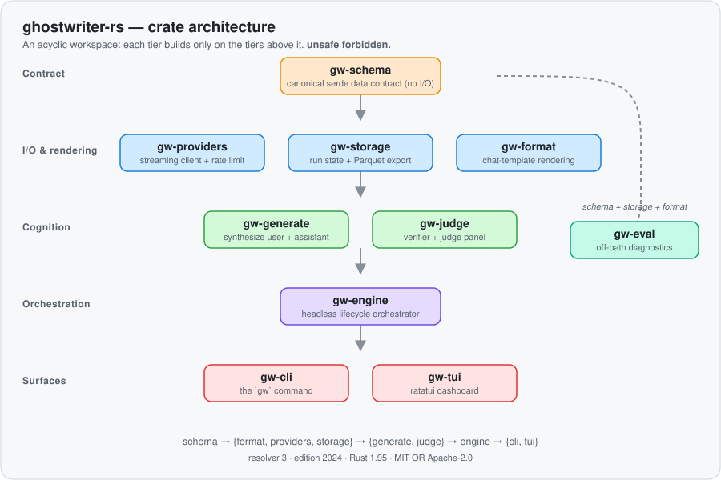
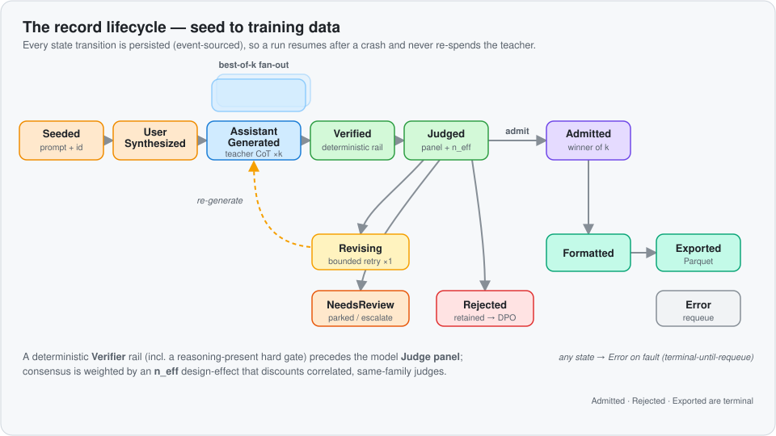

# ghostwriter-rs

**A Rust harness for generating graded chain-of-thought reasoning traces as model fine-tuning data.**


ghostwriter-rs drives a **teacher** model to produce full chain-of-thought reasoning, runs each
trace through a deterministic **verifier** and a model **judge panel**, admits only the traces that
earn it, and exports the winners as a model-agnostic supervised-fine-tuning (SFT) dataset. The whole
run persists lifecycle transitions, reuses completed teacher outputs on resume, and records the
model requests and grading evidence it observes.

Its goal is reproducible selection of reasoning traces for open-model training, with retained
verification, grading, request, and publication evidence. The current Rust core handles generation,
grading, persistence, artifact publication, and model-free diagnostics. External trainer adapters,
official tokenizer and loss-mask checks, immutable deployment identities, measured throughput,
and held-out student evaluation are further work; the pipeline alone does not establish student improvement.

> **Status:** active development toward `0.1.0`. The generation → grading → export pipeline runs
> end-to-end today; the surfaces and config are stabilizing. APIs may still shift before the first
> tagged release.

---

## Why

Distilling a strong reasoner into a smaller student is only as good as the data. Naively sampling a
teacher gives you fluent-but-wrong traces, silent truncations, and a corpus that quietly collapses
onto a few modes. ghostwriter-rs makes the quality bar **explicit and enforced**:

- a **verifier rail** rejects malformed or truncated traces before a judge ever sees them;
- a **judge panel** scores each trace against a rubric, and consensus is discounted when judges are
  correlated (so nine lookalike judges don't masquerade as nine independent votes);
- **best-of-k** generates several candidates per prompt and admits only the best;
- an explicit **accounting policy** either observes normal concurrent work or admits physical sends
  below a complete, known-spend dollar threshold.

The output is a self-contained Parquet dataset with an embedded manifest, ready to render into the
chat template of your target student model.

---

## Architecture

Ten crates in a strictly **acyclic** workspace — each tier depends only on the tiers above it.

<p align="center"></p>

| Crate | Role |
|---|---|
| `gw-schema` | Canonical serde data contract (no I/O). Everything depends on it. |
| `gw-providers` | Streaming OpenAI-compatible client with chain-of-thought capture, GCRA rate limiting, and retries. |
| `gw-storage` | Run / queue / provenance state (SQLite) and columnar Parquet export. |
| `gw-format` | Chat-template rendering and the SFT / preference export projection. |
| `gw-generate` | Gates provided user turns and generates teacher assistant responses. |
| `gw-judge` | The deterministic verifier and the model judge-panel grading + admission. |
| `gw-engine` | The headless orchestrator: the lifecycle state machine and sharded executor. |
| `gw-cli` | The `gw` command-line entrypoint. |
| `gw-tui` | A live [ratatui](https://ratatui.rs) dashboard over the engine event stream. |
| `gw-eval` | Off-path, model-free dataset diagnostics and promotion gating. |

The dependency spine: `schema → {format, providers, storage} → {generate, judge} → engine → {cli, tui}`,
with `gw-eval` consuming only `schema` + `storage`.

---

## How it works

Each prompt becomes a **record** that walks a 12-state lifecycle. Persisted transitions and completed
grades support resume and admission audits. An unresolved request may have reached its provider, so
recovery cannot guarantee remote exactly-once execution.

<p align="center"></p>

1. **Seeded** — a prompt is read from the seed source and a record id is minted.
2. **UserSynthesized** — the user turn is prepared and passes its gate.
3. **AssistantGenerated** — the teacher is called for **k** candidates, capturing content *and*
   reasoning.
4. **Verified** — a deterministic rail checks each candidate, including a *reasoning-present* hard
   gate when the area requires chain-of-thought.
5. **Judged** — the judge panel scores the surviving candidates; consensus is weighted by an
   **n_eff** design-effect that discounts correlated judges.
6. The verdict routes the record:
   - **Admitted** — the best of k (terminal-good for grading);
   - **Rejected** — retained for audit and potential preference-pair construction; no DPO qualification is implied;
   - **Revising** — a single bounded re-generation, then re-judged;
   - **NeedsReview** — parked for human/verifier adjudication.
7. **Formatted → Exported** — `Formatted` records are ready for publication. `Exported` follows
   verified artifact publication and database acknowledgment. Parquet preserves canonical messages;
   the target template and CoT policy describe downstream training intent.

`Error` is terminal-until-requeue: a faulted record carries its last error and attempt count, and a
re-run picks it back up.

### Judge scoring and cache reuse

Judges return a JSON score and verdict. The implemented method is `json_score`; the audit records
that method and its interpretation version. There is no logprob scoring algorithm or automatic
scoring fallback. The former `GEvalLogprob` / `IntegerLikert` pins and scoring selector have been
removed from the pre-1.0 API; numeric score normalization is unchanged.

Judge cache entries use `judge-request-v2` fingerprints of the built request, optional rubric ID,
sampling bits, scoring method, and interpretation version. Changes to rubric text, candidate text,
prompt framing, or interpretation invalidate the grade. Raw token caps that produce the same
effective request can share a grade, as can identical requests from different runs. The old folded
key helper is removed; legacy cache entries and historical audit records remain untouched but are
not reused by the new cache. This identity does not cover provider-internal routing defaults,
endpoint changes, or resolved model revisions. Cached grade audit data retains its originating
run and physical attempt when known; historical origins stay unknown. Consuming a cached grade
creates no new request receipt and imports no spend from the originating run.

---

## Install

Requires **Rust 1.95+** (edition 2024). The repository pins **Rust 1.98.1**
for development and release builds, including a macOS optimized-build fix.

```sh
git clone https://github.com/jscott3201/ghostwriter-rs
cd ghostwriter-rs
cargo build --release
```

The binary is `gw` (`target/release/gw`). Run `cargo run -- <args>` during development, or install it:

```sh
cargo install --path crates/gw-cli
```

---

## Quickstart

**1. Provide your provider key via the environment.** It is read only from `OPENROUTER_API_KEY` and is
never a config field or a CLI flag. A literal `export` command can still enter shell history; use
your shell or secret manager's protected input mechanism when entering a real key.

```sh
export OPENROUTER_API_KEY=sk-or-...
```

**2. Write a prompts file** — one user turn per line (lines beginning with `#` are skipped):

```text
# prompts.txt
A train leaves Boston at 60 mph and another leaves NYC at 40 mph...
Prove that the square root of 2 is irrational.
Design a rate limiter for an API gateway and justify the algorithm.
```

**3. Write a review-only config** (`gw.toml`) — see the [reference](#configuration) below:

```toml
db = "gw-run.sqlite"
accounting_policy = { mode = "finite_usd", limit_usd = 5.0 }

[area]
training_area = "reasoning"
admission_intent = "review_only"
teacher_slug  = "z-ai/glm-5.2"
cot_required  = true
k             = 3
rubric        = "Grade the reasoning for correctness, rigor, and explicit assumptions."

[area.thresholds]
accept_threshold = 0.80
reject_below     = 0.60
min_n_eff        = 1.5

[[area.judges]]
slug   = "deepseek/deepseek-v4-pro"
family = "deepseek"

```

**4. Run it** — generate, grade, and persist candidates for review; the report prints when it finishes:

```sh
gw gen run --config gw.toml --run-id demo-001 --prompts prompts.txt \
  --shards 8 --max-in-flight 8
```

Prefer a live dashboard? Swap `run` for `tui`. Crashed or interrupted? Re-run the **same** `--run-id`
with the **same** `--prompts` and `--shards` to resume — already-committed work is skipped and the
persisted teacher output is reused. Finite admission remains conservative about unresolved receipts.

The quickstart keeps the conservative correlation prior and effective-count floor. Its single judge
cannot clear that floor, so collection explicitly uses `review_only`. Otherwise admitted candidates
stay at `NeedsReview`; no admitted dataset is produced. The `k = 3` setting generates three candidate
answers per prompt and does not add judges.

**5. Export an automatic-admission run** after configuring an attainable panel as described below.
Export is a provider-free step you can repeat:

```sh
gw gen export --db gw-run.sqlite --out out/dataset.parquet --run-id automatic-001 \
  --format chat-ml --cot supervised
```

You get one `out/dataset.parquet` file. Its footer records the target template, CoT policy, optional
`--dataset-version`, record counts, selection scope and artifact identity. The command prints the
same manifest as JSON. It records a local publication receipt without changing generation run status
or record lifecycle. Historical sidecars are ignored and left untouched.

### Artifact publication and recovery

Export freezes the selected IDs, all eight projected columns and the complete manifest before writing.
It records a prepared receipt in SQLite, writes a unique staging file beside the destination, closes
the writer, then opens a fresh reader to verify the footer, schema, every batch, counts, IDs, hashes
and decoded messages. One rename replaces the destination; SQLite acknowledgment follows. A failure
before rename preserves the old destination and removes only the owned staging file.

After rename, a database error leaves the verified artifact on disk. Retry checks the persisted
receipt and the exact selected records. Later unrelated admissions are not added to a prepared
publication. If the destination contains different content, retry republishes the same frozen plan
through staging before acknowledgment. A file claiming the expected identity but failing verification
is an integrity error. A database error does not prove rollback: the receipt may already be
acknowledged if the commit succeeded but its response was lost.

Errors after preparation report a publication ID. Recover that exact publication without provider
credentials or projection overrides:

```sh
gw gen export --db gw-run.sqlite --resume-publication PUBLICATION_ID
```

This uses the receipt's recorded destination and may replace that file with the original frozen
artifact. It accepts prepared or acknowledged receipts and leaves later admissions untouched.
The original acknowledgment mode applies: an engine receipt may finish marking its selected records
`Exported`; a standalone receipt leaves lifecycle unchanged. Recovery never changes generation run
status or claims that generation completed. `--out`, `--run-id`, `--format`, `--cot` and
`--dataset-version` conflict with explicit recovery. Ordinary export still selects a fresh population
when no prepared receipt requires recovery.

This protocol does not claim a filesystem/SQLite transaction, a cross-process
publication lease, or power-loss durability; callers must serialize publication to a destination.

The engine keeps selected records at `Formatted` until its configured artifact is published and
acknowledged. Without configured output, a successful run reports readiness and `exported = 0`.
Configured output is published even when no records were admitted, producing a valid empty artifact
that replaces stale output. Publication failure fails the run; success events and `Completed` follow
acknowledgment. Standalone `gen export` leaves generation states unchanged.

The authoritative footer key is `ghostwriter.export_artifact`. Metadata version 1 wraps the existing
manifest, scope and `artifact_id`; the eight-column `canonical_messages` schema remains unchanged.
`gw_storage::verify_artifact` reads every batch and returns an explicit `MissingLegacyMetadata` result
for historical files without this entry. Ordinary Parquet row readers can still read those files.
No adjacent file is used to infer metadata.

`build_inputs_hash` retains its original meaning: BLAKE3 of sorted admitted `record_hash` values,
each followed by a newline. The separate artifact identity covers the complete projection, manifest
and scope, including empty populations. It excludes the destination and its own ID field. Metadata
does not invent missing model identities or claim a complete generation provenance graph.

For independent version-1 identity implementations:

1. Sort rows by `record_id` in UTF-8 byte order. Reject duplicate IDs. A framed string is its UTF-8
   byte length as an unsigned 64-bit big-endian integer followed by those bytes.
2. Hash each row with BLAKE3 derive-key context `ghostwriter.export.projected-row.v1`: framed
   `record_id`, `training_area`, `record_hash`, `prompt_hash`; verdict presence byte (`0` absent,
   `1` present) and framed verdict when present; aggregate presence byte and its exact IEEE-754
   64-bit big-endian bits when present; unsigned 32-bit big-endian `reasoning_tokens`; framed
   `messages_json`. Encode the resulting digest as lowercase hexadecimal.
3. Hash the artifact with context `ghostwriter.export.artifact.v1`: unsigned 32-bit big-endian
   `metadata_version`; framed scope JSON; framed complete manifest JSON; unsigned 64-bit big-endian
   row count; each framed hexadecimal row digest in sorted order. Scope and manifest JSON use the
   version-1 typed fields, recursively sorted object keys, compact separators and UTF-8 strings.
   Optional absent manifest fields are omitted and defaulted fields use their serialized values.

---

## Physical request receipts

`Engine::run` records physical chat and embedding attempts in SQLite. Each built-in HTTP client
awaits a durable intent immediately before its POST, after any rate-limit wait. An intent failure
prevents that request. Intentional chat retries each receive a new receipt; automatic redirects
and reqwest protocol retries are disabled for chat and embeddings. The HTTP/2 regression fixture
enables HTTP/2 only in test builds and exercises a real `REFUSED_STREAM` response through the
same client-builder retry policy.

A receipt binds the run and a fresh launch ID to an optional shard, intended record, role, purpose,
requested model, sanitized endpoint, exact request-body digest and retry ordinal. Intended records
need not exist yet. Context travels outside the serialized model request, so it does not alter
teacher sampling or judge-cache fingerprints. The captured response identifiers describe what the
backend reported; absent model revisions remain absent.

| Role | Purposes |
|---|---|
| Teacher | Initial generation, truncation retry, revision |
| Judge | One panel member's grade |
| Embedding | Candidate QC, newly admitted prior, prior rebuilt on resume |

`Store::model_attempts(run_id)` returns receipts. `Store::model_launches(run_id)` returns the actual
injected clients' capabilities assessed at each launch. Custom implementations default to
`Unknown`; `NullEmbedder` explicitly performs no model requests. A declaration is a cooperative
extension contract. Wrapping a logical call or accepting a no-op callback does not establish its
hidden transmission behavior. Engine helpers such as `step`, `drive`, `drive_to_judged`, `run_group`,
and `revise_once` reject model dispatch without registered launch context. Pure computation,
cache hits, and implementations declaring `NoModelRequests` remain usable. Raw provider APIs are
outside the engine's run accounting contract.

Usage fields are optional evidence. A reported zero differs from omitted cost, and explicit null,
negative, non-finite or malformed cost is invalid. Counts accept unsigned integers and integer
strings; explicit null, fractional or overflowing counts are marked invalid. A null usage container
means no measurement, and null optional response/model/provider identifiers add no new identity
evidence. Metadata extraction is independent of the teacher, judge and vector parsers, including
malformed output. An observed SSE response continues
to drain metadata after its first content-decoding error and returns that original error after
transport settles. Changed observations receive ordered identities within each physical attempt.
Exact persistence retries reuse that identity and return its stored result. A fresh return to older
cumulative values or reuse of an identity with different data remains a durable conflict. Cumulative
snapshots are never added together. Token deltas with unchanged metadata do not write the database.

Transport settlement and output interpretation are separate: a completed HTTP response can
contain an invalid grade or truncated reasoning. Elapsed milliseconds measure wall time from the
persisted intent to settlement; they do not measure GPU compute. Accounting failures are fatal
and cannot become an automatic resend or a skipped prior-building warning. A committed admission
remains recorded if its subsequent prior embedding fails.

### Accounting policy and replay

The shared policy is a tagged value:

- `observation_only` records available tokens, client wall time, and costs without requiring prices.
  It retains the engine's existing bounded concurrency, including concurrent unknown-priced calls.
- `finite_usd` requires a finite, nonnegative `limit_usd`. Every physical chat or embedding POST,
  including retries, checks its captured policy epoch, historical coverage, unsettled intents,
  invalid/conflicting evidence, and known spend in the transaction that writes its intent. At most
  one request is unresolved per run under this policy. It waits only for requests held by the live
  coordinator; an orphan or foreign unresolved receipt halts new dispatch.

A finite limit is a **dispatch threshold**, not an invoice ceiling. A last response may cross it;
local grading finalization, caching, persistence and publication can still complete. If another
request is needed, that send is denied and the item keeps its unfinished checkpoint. Zero is valid
and permits cache-only or local completion, while denying fresh physical requests.

Fresh engine runs atomically persist the run, seed partition, operational policy and actual client
coverage before any startup embedding or model request. Older runs remain explicitly incomplete;
an empty legacy receipt table does not prove zero historical spend. A finite launch requires
complete history and known coverage of every lane. A later replacement with an unknown client is
reassessed and cannot inherit the previous client's certification.

The policy is operational authority with a durable epoch, separate from generation request and
cache identity. Reusing an unchanged policy preserves its epoch. Changing to a finite policy requires
complete, settled, valid price evidence; observation-only can supersede a finite policy despite an
unresolved receipt. Old authorized requests may settle, but the superseded coordinator cannot send
again. Replay uses the complete run receipt ledger, including failed or malformed outputs and
embeddings. It never reconstructs spend by summing record-level teacher projections.

CLI terminal reports refresh SQLite after run, replay, or TUI settlement, including best-effort
failure reporting without replacing the primary error. They show requested, configured and effective
policies, epochs, known dollars, unknown/invalid/conflicting/unresolved counts, coverage, optional token
totals and client wall-clock milliseconds. Token categories can overlap and are not added together.
The dashboard applies absolute snapshots by revision, so corrections may reduce a displayed subtotal;
dropped events never become the authoritative final accounting. Observation-only shows no monetary gauge.

Dropping a request performs no background persistence or drain. Process loss after intent leaves
an unresolved receipt: it may or may not have transmitted. Resuming does not establish remote
exactly-once execution. The current SQLite durability settings and receipts do not constitute
power-loss qualification or provider-invoice reconciliation.

---

## Configuration

Configuration is layered, lowest precedence first: **built-in defaults → TOML file (`--config`) →
`GW_`-prefixed environment variables → CLI flags**. Defaults deserialize without a file, but generation
requires a nonempty judge panel and a valid admission configuration before any provider is constructed.

```toml
# ─── run-wide ───────────────────────────────────────────────────────────────
db          = "gw-run.sqlite"   # SQLite store: run state, queue, provenance
accounting_policy = { mode = "finite_usd", limit_usd = 5.0 }
# For local/unpriced backends: accounting_policy = { mode = "observation_only" }
provider_base_url = "https://openrouter.ai/api/v1"   # OpenAI-compatible endpoint
provider_rpm      = 60          # shared teacher + judge chat requests/min

# ─── the training area: what to generate and how to grade it ────────────────
[area]
training_area = "reasoning"     # stamped into provenance + the record-id prefix
admission_intent = "review_only" # explicit collection mode; default is "automatic"
teacher_slug  = "z-ai/glm-5.2"  # any OpenRouter chat model that emits reasoning
cot_required  = true            # require chain-of-thought (a hard Verify gate)
k             = 3               # best-of-k fan-out (default 1; clamped to >= 1)
correlation_rho = 0.7           # cold-start inter-judge correlation prior

# Optional teacher caps — keep a long reasoner from running away mid-trace:
teacher_max_tokens           = 20000   # combined completion cap (visible + reasoning)
teacher_reasoning_max_tokens = 12000   # reasoning-token sub-cap

# Optional area-wide judge headroom for dense traces (per-judge overrides below):
judge_max_tokens           = 8000
judge_reasoning_max_tokens = 6000      # mutually exclusive with judge_reasoning_effort

rubric = """
Grade the reasoning trace for correctness, rigor, and clarity.
Reward sound derivations and explicit assumptions; penalize unjustified leaps.
"""

# ─── admission thresholds + the correlation-guard floors ────────────────────
[area.thresholds]
accept_threshold = 0.80   # aggregate >= this (with trusted consensus) -> Admit
reject_below     = 0.60   # aggregate <  this -> Reject
min_n_eff_ratio  = 0.50   # floor on effective/nominal judge count
min_n_eff        = 1.5    # absolute effective-judge floor, else -> NeedsReview

# ─── the judge panel (one or more; same-family judges are de-weighted) ──────
[[area.judges]]
slug   = "deepseek/deepseek-v4-pro"
family = "deepseek"        # coarse family tag for same-family exclusion
# optional per-judge overrides: rubric_id, max_tokens, reasoning_max_tokens, reasoning_effort

# ─── optional end-of-run export ─────────────────────────────────────────────
[export]
out             = "out/dataset.parquet"
format          = "chatml"       # TOML enum spelling; CLI uses chat-ml
cot             = "supervised"   # supervised | masked | stripped
dataset_version = "0.1.0"
```

Notes:

- **The API key is never in this file.** Only `OPENROUTER_API_KEY` (from the environment) authenticates.
- `judge_reasoning_max_tokens` and `judge_reasoning_effort` are **mutually exclusive** in the same
  table — set one or the other, not both. The same holds for per-judge `reasoning_max_tokens` /
  `reasoning_effort`.
- Configuration keys can be overridden with `GW_` variables. For example,
  `GW_ACCOUNTING_POLICY__MODE=observation_only` selects a complete policy, replacing a finite
  policy from the file. `GW_ACCOUNTING_POLICY__MODE=finite_usd` requires a same-layer
  `GW_ACCOUNTING_POLICY__LIMIT_USD`. CLI `--accounting-policy finite-usd --limit-usd 10` or
  `--accounting-policy observation-only` replaces the complete file/env policy.
  The default is finite USD 5 only when no policy was supplied. Observation-only with a limit,
  nonfinite or negative limits, missing finite limits, removed `budget_usd` / `on_breach` keys,
  and removed flags are errors. Other common flags include `--k`, `--shards`, and `--admission-intent`. The intent environment
  setting is `GW_AREA__ADMISSION_INTENT=review_only`; its CLI spelling is `--admission-intent review-only`.

### Admission preflight

Automatic admission is the default intent. Before credentials or provider calls, the resolved panel
must be nonempty, score bands must satisfy finite `0 <= reject_below <= accept_threshold <= 1`, and
the effective-count floors must be finite and in range (`min_n_eff >= 0`, ratio in `[0,1]`). The
correlation prior is finite in `[0,1]` and must be positive and nonidentity for multiple judges.

Under equal cold-start weights, `d` decisive votes have
`n_eff = d / (1 + (d - 1) * correlation_rho)`. Preflight considers every `d` from one through the
number of judges, because uncertain votes are excluded. Some `d` must meet both the absolute and
relative floors. The default prior `0.7` and absolute floor `1.5` cannot do so, even with a larger
panel. `review_only` bypasses this attainability check while keeping all numeric safeguards. Its
intent is stored with each candidate; otherwise admitted candidates remain `NeedsReview` on replay
and rederivation. Verifier hard failures still reject.

**An attainable example under an assumed prior:** the following two-judge panel assumes `rho = 0.2`.
Two decisive judges then give `n_eff = 1.667` and `n_eff/d = 0.833`, clearing both stated floors.
This is a declared assumption, not measured calibration or evidence of judge independence. Use a
new run ID, such as `automatic-001`, when collecting under this configuration.

```toml
[area]
admission_intent = "automatic"
correlation_rho = 0.2
k = 3                         # candidate answers per prompt; there are two judges below

[area.thresholds]
accept_threshold = 0.80
reject_below = 0.60
min_n_eff = 1.5
min_n_eff_ratio = 0.7

[[area.judges]]
slug = "deepseek/deepseek-v4-pro"
family = "deepseek"

[[area.judges]]
slug = "z-ai/glm-5.2"
family = "glm"
```

---

## CLI reference

```
gw gen run      Headless run: generate → grade → admit → persist; prints the report.
gw gen tui      The same run with the live ratatui dashboard.
gw gen export   Export admitted records from a store to a Parquet shard (no providers).
gw gen replay   Resume a started run from its persisted checkpoints.
gw eval audit-separation   Score diagnostics and optional independent outcome evidence (JSON).
gw eval promote            Variance-aware promotion gate over two eval_results.json (JSON).
```

**`gw gen run` / `gw gen tui`**

| Flag | Meaning |
|---|---|
| `--config <FILE>` | TOML config (the figment base layer). |
| `--run-id <ID>` | Idempotency key. Re-running the same id over the same seeds **resumes**. |
| `--prompts <FILE>` | Newline-delimited prompts file (one user turn per line). |
| `--db <PATH>` | Override the SQLite store path. |
| `--shards <N>` | Partition the seed space into N shards (default `1`) — the primary concurrency axis. |
| `--max-in-flight <N>` | Cap on seed items in flight across all shards (default `4`). |
| `--k <K>` | Override the best-of-k fan-out. |
| `--accounting-policy <MODE>` | `observation-only` or `finite-usd`; shared by run, replay, and TUI. |
| `--limit-usd <USD>` | Required with explicit `finite-usd`; forbidden with observation-only. |
| `--admission-intent <INTENT>` | `automatic` or `review-only`; also accepted by replay. |

**`gw gen export`** — `--db`, `--out`, optional `--run-id`, `--format`, `--cot`, and
`--dataset-version`. `--resume-publication <ID>` substitutes for `--out` and rejects projection overrides.
Standalone and automatic end-of-run exports use the same SFT eligibility rule: records need an
`admit` judging verdict and an `admitted`, `formatted`, or `exported` lifecycle state. Retained
best-of-k losers keep their individual grades in the store but do not enter the dataset. Unfinished,
rejected, review, and error states are excluded. The manifest counts all scanned records in
`n_records`; `n_admitted` and `build_inputs_hash` describe only the selected exported rows.

**`gw gen replay`** — resumes `--run-id` from a store using matching generation settings and the
**same** `--prompts` and `--shards` the original run used (the seed→shard partition is `index % shards`, so a
different value would re-partition the space and duplicate or orphan records). Replay accepts the
same accounting flags as run/TUI; an explicit policy change follows the epoch rules above.

> **Concurrency.** `--max-in-flight` bounds seed groups across shard tasks; it does not count
> physical HTTP requests. Each group's `k` siblings may overlap under observation-only, while each
> sibling's cached judge panel is evaluated in sequence. Teacher and judge chat calls share the
> configured RPM limiter. Embedding calls have their own asynchronous path. Finite accounting
> serializes physical model requests regardless of these pipeline concurrency bounds.

A fatal shard error or panic stops new work and joins every shard before the run reports failure.
Surviving shards settle started transitions at a persisted boundary; grading may finish its panel and
internal retries. The first observed shard failure remains the returned error even if saving the
failed run status also fails. A provider that never returns can delay shutdown: the engine adds no
provider deadline. Dropping the run future aborts its shard tasks without guaranteeing that their
in-flight work is persisted.

---

## Export targets & CoT policy

`--format` records the target chat template in the export manifest. The Parquet shard itself is a
**columnar dump of the canonical conversation, not a pre-rendered template** — the target bytes are
produced downstream from the manifest plus the conversation column:

| `--format` | Target |
|---|---|
| `gemma4` | Gemma-4. The renderer has golden-file tests; they are **pending a byte-for-byte diff-verify against the official pinned `chat_template.jinja`** before production SFT (nothing fetches the template at runtime). The system turn is folded into the following `user` turn and the upstream `<\|think\|>` marker is not emitted. |
| `chat-ml` | ChatML. |
| `sharegpt` | ShareGPT. |
| `openai-messages` | OpenAI `messages` conversational. |
| `harmony` | gpt-oss Harmony channels. |
| `trl-prompt-completion` | TRL prompt/completion. |

**Tool trajectories.** `openai-messages` and `trl-prompt-completion` carry `tool_calls` and each
tool result's `tool_call_id` verbatim. The other four targets (`gemma4`, `chat-ml`, `sharegpt`,
`harmony`) have nowhere to put them, so rendering a tool conversation for one **fails closed** with
a structured error naming the route, the dropped signal and the first offending message — it never
emits a training target in which a tool turn has been flattened into prose. The supported way to get
a tool-faithful target is to export the canonical `messages_json` conversation and apply the model's
official chat template in a consumer that owns that template. Text-only conversations are unaffected
on every target.

`--cot` records downstream training intent. Every policy preserves the same canonical messages in Parquet:

- **`supervised`** — train on captured reasoning.
- **`masked`** — include reasoning as context while excluding it from loss.
- **`stripped`** — construct an answer-only training example downstream.

The export is a columnar Parquet dump plus a manifest. One `messages_json` column holds the canonical
`Message[]` JSON in conversation order, losslessly: the `content` variant (including `null`),
`reasoning`, `reasoning_details`, `tool_calls` and the `tool_call_id` links all survive, so a
consumer decodes it straight back into `Message[]`. (The historical v1 `{role, content}` +
parallel `reasoning_json` pair was lossy — `reasoning_json` is gone, and `column_schema_version` in
the manifest records which contract a shard was written under.) The CoT policy and the target are
recorded as manifest metadata so a downstream trainer applies the matching loss mask and template.
The exporter does not emit token IDs or loss labels and does not qualify official tokenizer,
truncation, or trainer behavior. TOML format values are `gemma4`, `chatml`, `share_gpt`,
`open_ai_messages`, `harmony`, and `trl_prompt_completion`; CLI spellings are shown in the table.

---

## Evaluation

`gw-eval` is **off-path and model-free** — it reads persisted records and eval artifacts, never calls
a provider:

- **`gw eval audit-separation`** reports verifier mixedness and judge-score spread. Optional
  independent outcomes evaluate the declared judge-score selection rule over a frozen corpus.
- **`gw eval promote`** is a variance-aware gate over two `eval_results.json` snapshots
  (baseline vs candidate) plus a drift exit code, printing a binary promotion decision.

Both accept `--check` to opt into decision-bearing process exits (`0` pass · `1` operational error ·
`2` gate rejects) for CI.

### Independent selector outcomes

Judge-score spread is descriptive: a group's maximum necessarily reaches or exceeds its own mean.
Without `--outcomes`, `outcome_evaluation.status` is `insufficient_evidence`, its `statistics` are
`null`, and `--check` exits `2`. The diagnostic `--min-decidable-groups` and
`--min-decidable-fraction` settings only control the mixedness warning.

```sh
gw eval audit-separation --db run.sqlite --run-id run-1 --outcomes outcomes.json --check
```

The version 1 outcome envelope uses one run, one area, one bounded metric, and one reference
protocol for an explicit frozen corpus. Its JSON structure is:

```json
{
  "version": 1,
  "run_id": "run-1",
  "training_area": "math",
  "metric": {
    "name": "task_success",
    "version": "v1",
    "direction": "higher_is_better"
  },
  "provenance": {
    "source": "deterministic_task_reference",
    "protocol_revision": "task-reference-v1",
    "reference_artifact_digest": {
      "algorithm": "sha256",
      "hex": "<full 64-character lowercase digest of the reference artifact>"
    }
  },
  "sampling_assumption": "independent_prompts",
  "corpus": [],
  "outcomes": []
}
```

Replace the digest placeholder and populate both lists before evaluating. `corpus` contains exact
bindings with `record_id`, `run_id`, `training_area`, `prompt_hash`, and `record_hash`. Use the full
recomputed hashes: the Rust helper `gw_eval::outcomes::CandidateBinding::from_record` constructs
them. `record_hash` follows the storage content-hash contract; run and area are also checked
explicitly. Each `outcomes` entry contains `candidate` (the same complete binding) and `outcome`,
either `{"status":"known","value":1.0}` or `{"status":"unknown","reason":"not measured"}`.
Known values must be finite and in `[0,1]`.

`adjudicated_reference` is the other accepted source; `blake3` is the other digest algorithm.
Every label uses the envelope's single metric and provenance contract. Per-label overrides,
unknown fields, duplicate labels, stale content hashes, conflicting identities, and labels outside
the declared corpus are invalid. Store filters must retain every declared member. Later records
outside the frozen member list do not enter its random-control population. A missing or unknown
outcome anywhere in the declared corpus blocks qualification, including when other prompts have
complete labels.

The evaluated population is all-pass prompt groups with at least two scored candidates. The policy
chooses the highest judge score and breaks ties by the lowest completion index; evaluated indices
must be present and distinct within each prompt. It compares that candidate's independent outcome
with the uniform-random expected outcome over the same scored candidates. Each distinct prompt hash
receives equal weight, so repeated prompts do not increase the independent sample count.

The report records the policy, metric, reference provenance, coverage, typed reasons, confidence
level, and the declared independent-prompt sampling assumption. Under that assumption, its
one-sided Hoeffding lower bound is `mean_gap - sqrt(2 * ln(1/alpha) / n)` for prompt gaps in `[-1,1]`,
where `alpha = 1 - confidence_level`. Qualification requires a positive lower bound and at least
30 evaluated prompts by default. `--confidence-level` (default `0.95`) and
`--min-evaluated-prompts` make those settings explicit.

Complete evidence with insufficient statistical support is `inconclusive`. Missing/unknown evidence
is `insufficient_evidence`; both exit `0` after successful analysis or `2` with `--check`. Semantic
invalidity prints an `invalid_evidence` report and exits `1` in either mode. Parse or I/O errors exit
`1` without a report. Absent numeric comparisons serialize as `null`.

Reference provenance is an auditable declaration, not proof of evaluator independence or blinding.
Qualification concerns this selection rule and declared corpus. It does not qualify the engine's
full admission policy, model quality outside that corpus, or downstream student learning benefit.
Synthetic fixtures establish software behavior only.

### Promotion

Promotion requires every benchmark supplied on either side, plus the configured headline metric,
to be present on both sides. Aggregate-only comparisons remain supported. Missing scores, reserved
aggregate names in benchmark maps, non-finite scores, and overflowing comparison arithmetic reject
with `evidence_valid: false` and structured `evidence_issues`. Retuning the report cannot override
that rejection. Valid threshold fields remain JSON numbers; invalid thresholds are `null` (the Rust
report fields `ab_min_delta` and `ab_sigma_k` are `Option<f64>`). Without `--check`, a gate rejection
still exits `0` and prints its report. Malformed JSON exits `1` in either mode.

`aggregate` and `eval_results.aggregate` are aliases for one headline, reported under the dotted
name. Either alias may name its sigma prior; if both priors are supplied, their normalized values
must agree. Negative or non-finite sigma priors still normalize to zero. Missing priors still use
zero, and `ab_avg_n` currently does not replace priors with measured variance.

These artifacts carry metric names and scores, without task-version, dataset, checkpoint, template,
or unit identity. The gate checks supplied evidence completeness; callers must establish those
compatibility conditions. It does not enforce an external required benchmark suite or a `[0, 1]`
score range.

---

## Security

- `OPENROUTER_API_KEY` is read from the environment by the provider constructor only — **never** from
  the config file, a CLI flag, serialization, or logs. The `GW_` env prefix can't slurp it.
- `unsafe` code is **forbidden** workspace-wide.
- See [SECURITY.md](SECURITY.md) for reporting.

---

## Contributing

Issues and PRs are welcome — see [CONTRIBUTING.md](CONTRIBUTING.md). The workspace builds with
`cargo build`, lints with `cargo clippy --workspace --all-targets`, and tests with
`cargo nextest run --workspace` (or `cargo test`).

## License

Licensed under either of [MIT](LICENSE-MIT) or [Apache-2.0](LICENSE-APACHE) at your option.
Unless you explicitly state otherwise, any contribution you submit shall be dual-licensed as above,
without additional terms or conditions.
